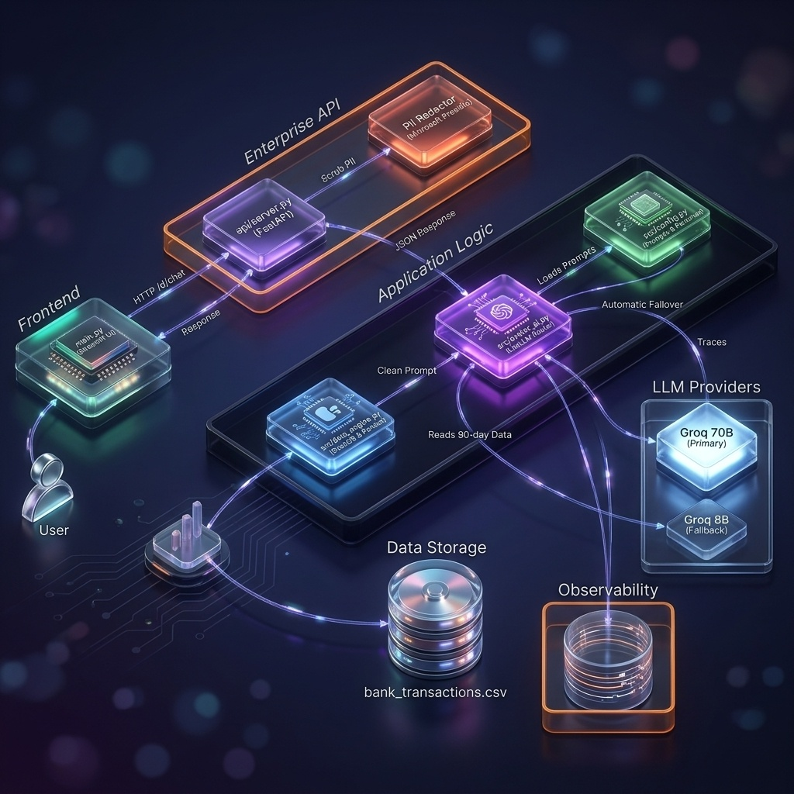
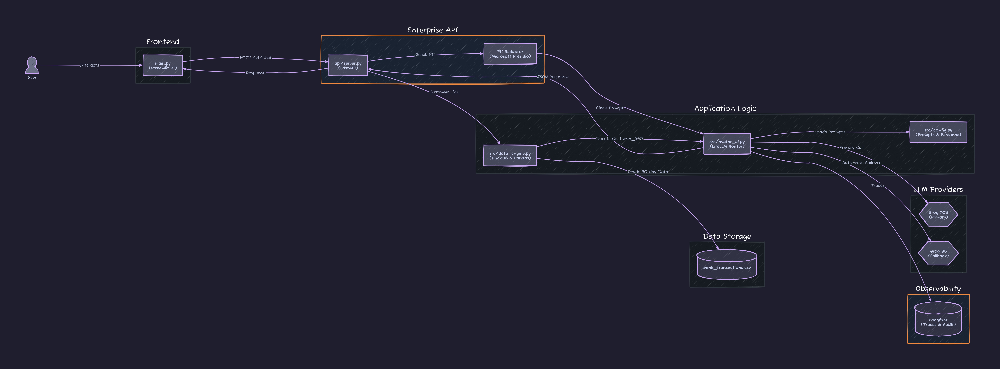
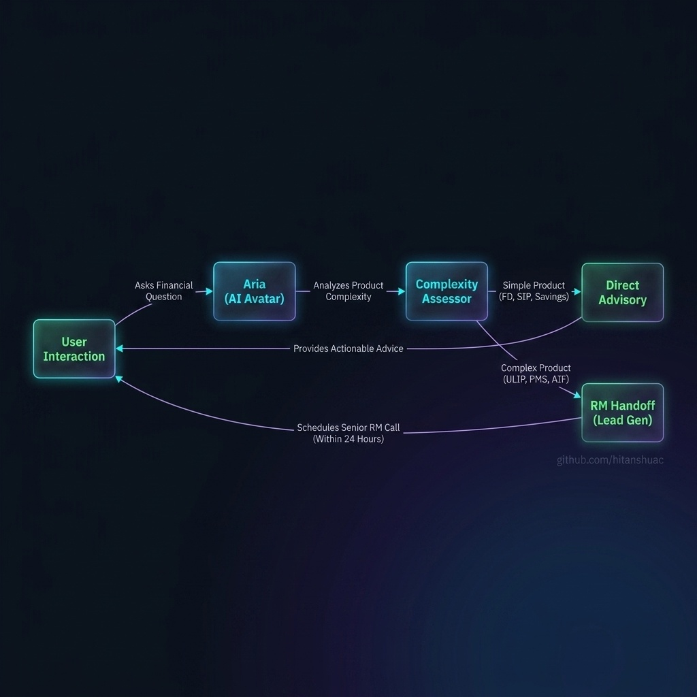
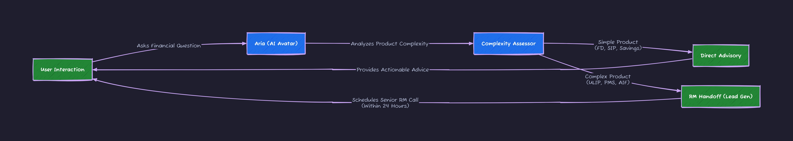
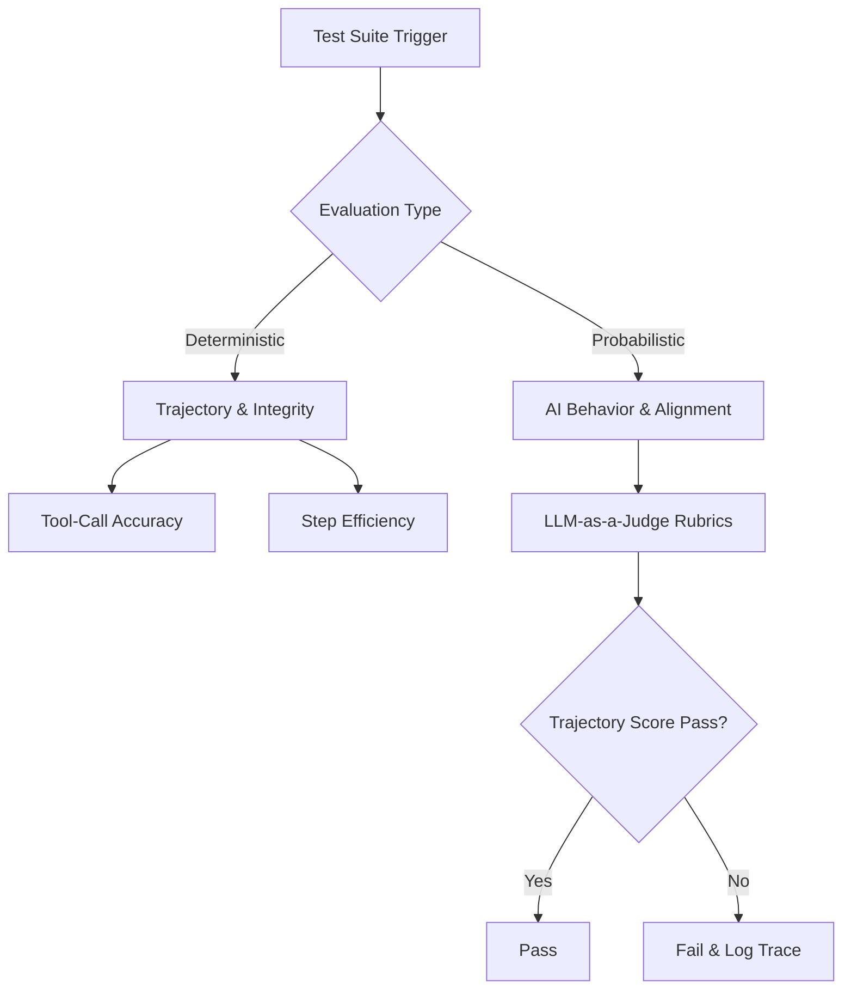

# 🌌 Finvestor — Digital Wealth Advisory Avatar


## 🏗️ System Architecture

*Technical View:*


## 🔄 Agentic Handover Flow

*Technical View:*


## 📖 Overview
This repository serves as the MVP for **Finvestor — Digital Wealth Advisory Avatar**, built for the IDBI Bank Hackathon (Track 1). The application is a modular Streamlit dashboard backed by an enterprise-grade FastAPI backend, featuring 6 core architectural layers strictly separating concerns:

1. `api/server.py`: FastAPI backend that decouples the UI from the AI orchestration, providing secure endpoints (`/v1/chat`).
2. `api/middleware/pii_redactor.py`: Microsoft Presidio integration with custom Indian recognizers (Aadhaar, PAN, IFSC) to scrub sensitive data before LLM transmission.
3. `src/data_engine.py`: Loads domain-accurate 90-day INR transactions via Pandas from `data/bank_transactions.csv` and executes DuckDB Customer_360 SQL queries.
4. `src/avatar_ai.py`: LiteLLM multi-provider router featuring the Aria Persona, automatic model failover (Groq 70B -> Groq 8B), and Langfuse observability tracing.
5. `src/widgets.py` & `main.py`: Generative UI integration. The thin Streamlit presentation orchestrator intercepts LLM structured JSON to render in-chat interactive Plotly chart widgets (without brittle dynamic code generation).
6. `src/config.py`: Hardcoded prompts, constants, and custom behavioral personas (e.g., High Spender vs. High Saver).

The underlying infrastructure utilizes a strict **Split-Plane Architecture** that separates the human-defined control plane (`.agents/`) from the system-managed data and state plane (`data/`).

## 📦 Installation & Setup

```bash
# 1. Clone the repository
git clone https://github.com/hitanshuac/Finvestor.git
cd Finvestor

# 2. Create and activate a virtual environment
python -m venv .venv
# On Windows: .venv\Scripts\activate
# On Linux/Mac: source .venv/bin/activate

# 3. Install dependencies
pip install -r requirements.txt

# 4. Set up environment variables
# Copy .env.example to .env and add your GROQ_API_KEY
cp .env.example .env

# 5. Run the application
# On Windows:
run.bat
# On Linux/Mac:
bash run.sh
```

## 📂 Directory Structure
```text
.
├── .agents/            # The Control Plane: Rules, Skills, and Workflows (Human Edited)
├── api/                # The Enterprise Backend: FastAPI endpoints, Presidio PII Middleware, Pydantic schemas
├── src/                # Application logic (data_engine, avatar_ai, config, widgets, tests)
├── main.py             # Thin Streamlit UI Orchestrator (Generative UI Renderer)
├── data/               # The Data Plane: DuckDB metrics, Quarantine DLQs, and Parquet files
└── docs/               # Architecture Decision Records, PRDs, and Visual Assets
```

## 🧪 Dual-Prong Testing Architecture (2026 Evals Standard)


## 🛡️ Future SRE Guardrails (Phase 2)
During MVP development, we identified the critical vulnerability of "Black Box API" dependencies (e.g., silent IP bans, LLM rate limits). To scale this safely for IDBI Bank, the following Git-level guardrails will be implemented in Phase 2:

1. **VCR/Proxy Mocking:** Implementation of local request playback to prevent API exhaustion during UI/UX development.
2. **ADR Institutional Memory:** `docs/ADR/` repository folder to document failure domains (e.g., why strict JSON parsing cannot use stream=True).
3. **Circuit Breaker Decorators:** Hardcoded try/except fallbacks that intercept 429/502 errors and serve graceful degradation JSON to the React frontend, preventing UI freezes.
