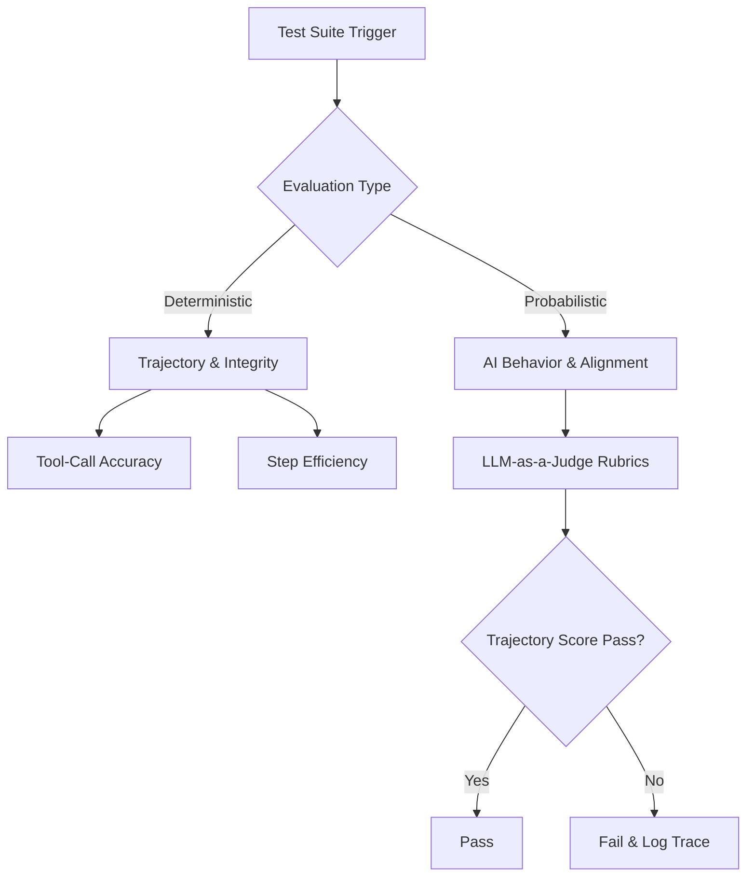

# 🌌 Finvestor — Digital Wealth Advisory Avatar


## 🏗️ System Architecture

*Technical View:*


## 🔄 Agentic Handover Flow

*Technical View:*


## 📖 Overview
This repository serves as the MVP for **Finvestor — Digital Wealth Advisory Avatar**, built for the IDBI Bank Hackathon (Track 1). The application is a modular Streamlit dashboard backed by an enterprise-grade FastAPI backend, featuring 6 core architectural layers strictly separating concerns:

1. `api/server.py`: Thin FastAPI HTTP router that exposes secure REST endpoints (`/v1/chat`).
2. `src/services/chat_pipeline.py`: Decoupled orchestration layer handling business logic, PII redaction, and Customer 360 building.
3. `src/domain/finance.py`: Pure domain logic containing risk profiling and investable surplus formulas (decoupled from data persistence).
4. `src/data_engine.py`: Pure persistence layer. Loads domain-accurate transactions and executes DuckDB Customer_360 SQL queries.
5. `src/ui/`: UI component presentation layer (`dashboard.py`, `chat.py`, `sidebar.py`) for the Streamlit dashboard.
6. `prompts/system_prompt.md`: Externalized markdown prompt asset (following `prompt-registry-sync`), replacing hardcoded strings for versionable A/B testing.

The underlying infrastructure utilizes a strict **Split-Plane Architecture** that separates the human-defined control plane (`.agents/`) from the system-managed data and state plane (`data/`).

## 🧠 AI Context Optimization (Antigravity UI Config)
To prevent "Lost in the Middle" context collapse in AI agents, this repository uses a deterministic routing strategy for its fragmented rules. **Do not set all `.agents/rules/` files to "Always On" in your IDE.** Configure your Antigravity AI UI as follows:
- **`00-*-core-safety.md`**: `Always On`
- **`20-*-phase-execute.md`**: `Glob` (`src/**/*.py`)
- **`30-*-phase-test.md`**: `Glob` (`tests/**/*.py`)
- **`10-phase-audit.md` & `40-phase-deploy.md`**: `Manual`

## 📦 Installation & Setup

```bash
# 1. Clone the repository
git clone https://github.com/hitanshuac/Finvestor.git
cd Finvestor

# 2. Create and activate a virtual environment
python -m venv .venv
# On Windows: .venv\Scripts\activate
# On Linux/Mac: source .venv/bin/activate

# 3. Install dependencies
pip install -r requirements.txt

# 4. Set up environment variables
# Copy .env.example to .env and add your GROQ_API_KEY
cp .env.example .env

# 5. Run the application
# On Windows:
run.bat
# On Linux/Mac:
bash run.sh
```

## 📂 Directory Structure
```text
.
├── .agents/            # The Control Plane: Rules, Skills, and Workflows (Human Edited)
├── api/                # The Enterprise Backend: FastAPI endpoints and Pydantic schemas
├── src/                # Application logic (domain, services, ui, data_engine, avatar_ai, config, widgets, tests)
├── prompts/            # Externalized Markdown prompt assets for version control
├── main.py             # Thin Streamlit UI Orchestrator (Generative UI Renderer)
├── data/               # The Data Plane: DuckDB metrics, Quarantine DLQs, and Parquet files
└── docs/               # Architecture Decision Records, PRDs, and Visual Assets
```

## 🧪 Dual-Prong Testing Architecture (2026 Evals Standard)


## 🛡️ Future SRE Guardrails (Phase 2)
During MVP development, we identified the critical vulnerability of "Black Box API" dependencies (e.g., silent IP bans, LLM rate limits). To scale this safely for IDBI Bank, the following Git-level guardrails will be implemented in Phase 2:

1. **VCR/Proxy Mocking:** Implementation of local request playback to prevent API exhaustion during UI/UX development.
2. **ADR Institutional Memory:** `docs/ADR/` repository folder to document failure domains (e.g., why strict JSON parsing cannot use stream=True).
3. **Circuit Breaker Decorators:** Hardcoded try/except fallbacks that intercept 429/502 errors and serve graceful degradation JSON to the React frontend, preventing UI freezes.
